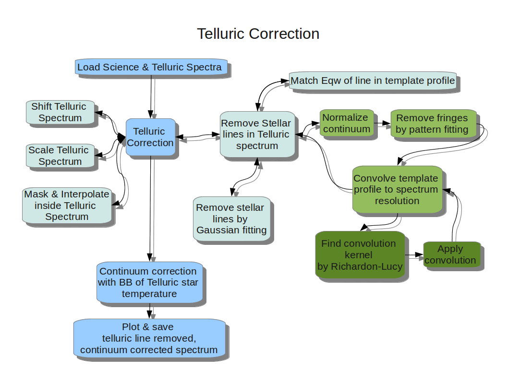

TIRSPEC
=================

[![IRC Freenode]](https://webchat.freenode.net?channels=%23tirspec&uio=OT10cnVlde)

Contains the scripts which has to be used for the basic reduction of TIRSPEC data.
And also some add-on scripts to assist during observation.
Codes are mostly in Python.

Feel free to modify as needed and use it while observing with TIRSPEC.
Make sure, you keep the modified scripts under a separate directory of your name, 
to prevent any conflict with default scripts for other users.

You may also find some helpful scripts in the following link: http://indiajoe.github.io/HandyTools4Astronomers/

Webpage of this repository: http://indiajoe.github.io/TIRSPEC/

Documentation for Pipeline : http://indiajoe.github.io/TIRSPEC/Pipeline/

#####For TIRSPEC instrument webpage, visit : http://web.tifr.res.in/~daa/tirspec/  #####

For detailed instruction on how to install and run the pipeline, see the wiki page : https://github.com/indiajoe/TIRSPEC/wiki

Contents
================
### CodesForUser: ###
*    **TIRSPECdataReduction.py** (needs **TIRSPECscript.conf**) *:* This script is to help the astronomer reduce tirspec data (output of *Generate4mRamp.py*) . It will semi-automate and guide the user through : *image selection, flat correction, aligning and combining of NIR dithered frames* for final photometry/spectroscopy.

The image below shows the major steps in TIRSPEC data reduction script. The boxes marked with faces needs human supervision.

For automated wavelength calibration, one needs to keep a calibrated template of the argon spectra in a directory.

*Module requirements: astropy, numpy and pyraf*

*NonPython requirements: iraf, sextractor*

*    **TelluricCorrection.py** *:* This is to remove the telluric lines and do continuum correction of final NIR spectra.
The flow chart of the processes one can take in telluric correction are shown below.

Make sure, the theoretical stellar line profiles of Vega star is available in same directory.

*Module requirements: astropy, numpy, scipy and matplotlib*

*    **FitWCS.py** *:* This is a stand alone script to add WCS information in fits header of an image.

*Module requirements: astropy, scipy, numpy*

*    **ExposureTimeCalculator.py** *:* This is a graphical tool to estimate the Photometric signal to noise ratio (S/N) one can obtain with different exposures and appertures.

*Module requirements: numpy, matplotlib*

*    **AlignCombineImagesinDir.py** *:* This is a stand alone script to help astronomer align and combine fits images.

*    **BadPixelMaskCreate.py** *:* This script is to generate a new bad pixel mask using two flat images.

*    **RenameImgs.sh** *:* Use this script to rename image filenames if you need to. It will update log files also.

### CodesOnServer:  
Intended for use on tirspec machine while observing.

*    **Generate4mRamp.py**  *:* This script generates the slope calculation from up-the-ramp readout raw data. It produces the dark subtracted final slope images. A log file is also generated. The flow chart below shows the major steps done in generating the final images before downloading to Hoskote from Hanle.

Module requirements: astropy and numpy

You can load this also as a module in IPython, and use the collection of functions in it for an interactive analysis of tirspec's raw data. The available functions inside this module are
   - filelist
   - CheckNDRexist
   - LoadDataCube
   - AverageDataCube
   - AverageWithCRrej
   - ReplaceCRhits
   - CRhitslocation
   - Generate_DarkTemplate
   - ApplyNLdarkcorr
   - NonlinearityCorrCoeff
   - ApplyNonLinearityCorrection
   - FitSlope

With additional module numexpr, Generate4mRampFaster.py can be used for a slightly faster and parallel version of this module.

*    **TelescopeShiftAssistantGUI.py** *:* A GUI based software for calculating shifts to be given in Autoguider as well as Observatory Server for dithering the telescope. It also has slit position calculator.

*    **StarPlot.py** (needs **StarPlot.gnuplot**) *:* This script is to quickly view the surface plot and contour of a star profile in fits file. 
*    **DitherAssistant.py** *:* To help in visualizing Dither pattern and generating the commands to be given to Observatory Server.
*    **TelescopeShift-4OS.py** *:* To get the input to be given to Observatory Server to move star to slit or any other location in image.
*    **TelescopeShift.py** *:* To get the input to be given to Keystone Server to move star to slit or any other location in image.
*    **AutoguiderShiftCalculator.py** *:* To get the shift to be given to Autoguider to move star to any other location in image.
*    **lastNDR.sh** *:* To quickly load the last NDR readout frame of the directory to DV.
*    **Start_TIRSPEC.sh** (needs **run_mkmac_h1_as.sh,run_dv_LampAlert.sh**) *:* This script starts TIRSPEC software for starting observation in the night.
*    **.dv-init** *:* Some DV start up script to make life easier while observing.
*    **DownloadFiles2CREST.sh** *:* Script to run slope generation scripts and download final data to Hoskote. 
     
Module Dependencies
-------------------
First few lines of the script will tell you the required python modules for each script.
For running all the scripts you will need: numpy, astropy, pyraf, scipy and matplotlib
      

License
---------

    This program is free software: you can redistribute it and/or modify
    it under the terms of the GNU General Public License as published by
    the Free Software Foundation, either version 3 of the License, or
    (at your option) any later version.

    This program is distributed in the hope that it will be useful,
    but WITHOUT ANY WARRANTY; without even the implied warranty of
    MERCHANTABILITY or FITNESS FOR A PARTICULAR PURPOSE.  See the
    GNU General Public License for more details.

    You should have received a copy of the GNU General Public License
    along with this program.  If not, see <http://www.gnu.org/licenses/>.